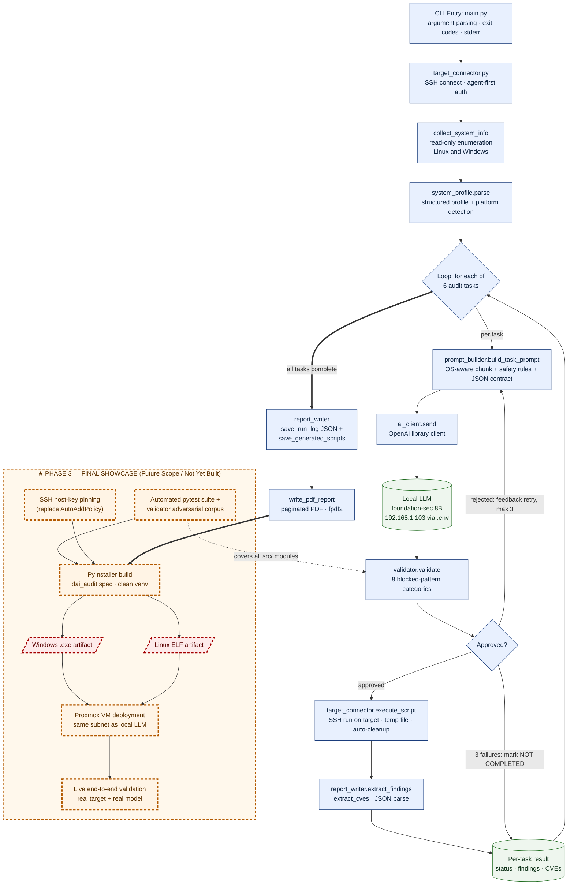

# Milestone Document — LAIN Security Framework (Defensive AI Audit Framework)

**Elevator pitch:** A Python proof-of-concept that runs on a controller machine and uses a self-hosted local LLM to generate machine-specific, **read-only** defensive audit scripts for remote targets over SSH, validates every generated script against a safety policy before execution, and produces a standardized paginated PDF report.

**Date:** 2026-06-21  **Milestone:** Phase 2 → Phase 3 (Final Showcase)

---

## SECTION 1: System Flowchart (Mermaid.js)

> Diagram source: [`phase3_flowchart.mmd`](phase3_flowchart.mmd) (standalone Mermaid file). The block below is a rendered copy kept inline for self-contained submission.

**Legend.** Solid blue boxes = **Current Functional Elements** (working in Phase 2). Green cylinders = current data stores/results. The dashed amber `★ PHASE 3` subgraph = **Final Showcase scope**; nodes there carry thick dashed borders, and the two distribution artifacts (`.exe` / ELF) are styled in dashed red to mark them as the headline deliverables.

---

## SECTION 2: Phase 3 (Final Showcase) Deliverables

The Phase 2 foundation (collection → prompting → generation → validation → execution → reporting) is functionally complete. Phase 3 converts that working pipeline into a **distributable, independently verified, production-deployed** tool. Each deliverable below states the feature, its precise scope, and its explicit Definition of Done (DoD).

### Core Architecture

- **Single-file standalone executables (Windows `.exe` + Linux ELF).** The complete controller — `main.py` plus all six `src/` modules and their third-party dependencies — will be bundled into one self-contained binary per operating system using a committed `dai_audit.spec` PyInstaller specification and per-OS build scripts.
  - *Done when:* the binary launches and runs a complete audit on a host that has **no** Python interpreter and **no** `pip`-installed packages, on both a clean Windows machine and a clean Linux machine.
- **Embedded dependency bundling.** All runtime libraries (`openai`, `paramiko`, `python-dotenv`, `fpdf2`) will be packaged inside the binary so the end user installs nothing manually.
  - *Done when:* a dependency inspection of the artifact confirms no external Python runtime is required, and the binary reaches `--help` and a successful run with only the artifact and a `.env` file present.
- **Externalized configuration boundary.** The local LLM address, model name, and credentials will remain in an external `.env` file that is read at runtime and never compiled into the binary.
  - *Done when:* string inspection of the shipped artifact contains no LLM IP address or key, and the same binary connects successfully after only the external `.env` value is changed.

### Data Flow / Logic

- **Live end-to-end pipeline execution.** The full sequence — SSH enumeration, structured profiling, per-task prompt generation, LLM response, safety validation, on-target execution, and report assembly — will be exercised end to end against a real LLM and a real target rather than simulated fixtures.
  - *Done when:* one invocation against a live target produces a real JSON run log and a real PDF in which at least one task reaches `completed` status and the report contains findings parsed from genuine target output.
- **Verified retry-and-recover behavior under real model output.** The `validate_with_retries` loop (maximum three attempts, validator objections fed back into the prompt) will be demonstrated against authentic 8B-model responses, including at least one task that is corrected on a retry and one that exhausts its attempts.
  - *Done when:* a single live run yields a report containing both a task `completed on attempt 2 or 3` and a task rendered in the explicit `NOT COMPLETED` block with its validator objections listed.
- **Standardized findings contract validated against live output.** Every executed script will emit the fixed findings JSON schema, and `extract_findings`/`extract_cves` will populate the report's severity summary and consolidated CVE section directly from that schema.
  - *Done when:* the generated PDF's severity table and "Referenced CVEs" section are populated exclusively from parsed live findings, with zero free-text fallback entries for the completed tasks.

### Infrastructure / Security

- **Proxmox VM deployment on the LLM subnet.** The packaged controller will be deployed on a dedicated Proxmox virtual machine that resides on the same network segment as the local LLM host (`192.168.1.103`), so model access is direct and contained.
  - *Done when:* the binary running on the Proxmox VM completes a full audit while reaching the LLM over the local network, with no external/internet egress required.
- **SSH host-key verification hardening.** The connection policy will be tightened from automatic host-key acceptance (`AutoAddPolicy`) to verification against a known-hosts store, so a target's identity is confirmed before any command or script is sent.
  - *Done when:* a connection to an unknown/changed host key is refused with a clear error, and a connection to a pre-registered host key succeeds.
- **Enforced read-only execution guarantee.** The validator's eight blocked-action categories (file deletion, file writes, credential access, privilege escalation, persistence, security-tool disabling, dynamic code execution, outbound network) will gate every script, and no script will ever reach the target without passing.
  - *Done when:* a code path audit confirms `execute_script` is unreachable for any task whose validation `approved` flag is `False`, demonstrated by a deliberately malicious task being blocked and never transmitted.
- **Non-committed secrets and isolated artifacts.** Generated scripts, JSON logs, and PDF reports will be written only to the gitignored `generated_scripts/`, `logs/`, and `reports/` directories, keeping run output and the `.env` secret out of version control.
  - *Done when:* a clean `git status` after a full run shows no tracked changes to output directories or `.env`.

### Testing / Validation

- **Automated unit-test suite (`pytest`).** Deterministic unit tests will cover the security-critical and parsing-critical modules: `validator`, `system_profile`, and the `report_writer` extraction helpers.
  - *Done when:* `pytest` runs green with tests asserting platform detection, package/network parsing, JSON findings extraction, CVE de-duplication, and the retry-loop outcome states.
- **Validator adversarial corpus.** A fixed corpus of known-malicious scripts — each forbidden action expressed in both shell-string form (`ufw disable`) and subprocess list form (`["ufw", "disable"]`) — will be asserted as rejected, alongside a corpus of legitimate read-only scripts asserted as approved.
  - *Done when:* 100% of the malicious corpus is blocked and 0% of the read-only corpus is falsely rejected, enforced as automated test assertions.
- **Live integration validation record.** The Proxmox live run will be captured as a reproducible validation record (the produced PDF and JSON log) demonstrating the full pipeline against real infrastructure.
  - *Done when:* the submitted evidence includes one PDF report and its paired JSON run log generated from a genuine target on the deployed VM.

### Packaging / Distribution

- **Reproducible build pipeline.** A clean-room build (`build.sh` for Linux, `build.bat` for Windows) will create an isolated virtual environment, install pinned runtime and build dependencies, and invoke PyInstaller against `dai_audit.spec`.
  - *Done when:* running the build script from a fresh checkout, with no pre-existing virtual environment, produces the platform binary in `dist/` on both operating systems.
- **End-user run procedure.** A concise operator procedure will document the two prerequisites for running the artifact — placing a `.env` beside it and supplying `--target`/`--user` — and the agent-first SSH authentication path.
  - *Done when:* a user following only the documented steps, using only the binary and a `.env`, completes an audit and locates the resulting PDF without consulting source code.
