# Milestone Document — LAIN Security Framework (Defensive AI Audit Framework)

**Elevator pitch:** A Python proof-of-concept that runs on a controller machine and uses a self-hosted local LLM to generate machine-specific, **read-only** defensive audit scripts for remote targets over SSH, validates every generated script against a safety policy before execution, and produces a standardized paginated PDF report.

**Date:** 2026-06-21  **Milestone:** Phase 2 → Phase 3 (Final Showcase)

---

## SECTION 1: System Flowchart (Mermaid.js)

> Diagram source: [`phase3_flowchart.mmd`](phase3_flowchart.mmd) (standalone Mermaid file). The block below is a rendered copy kept inline for self-contained submission.

```mermaid
flowchart TD
    %% ============ CURRENT FUNCTIONAL ELEMENTS (Phase 2 — working now) ============
    A["CLI Entry: main.py<br/>argument parsing · exit codes · stderr"]
    B["target_connector.py<br/>SSH connect · agent-first auth"]
    C["collect_system_info<br/>read-only enumeration<br/>Linux and Windows"]
    D["system_profile.parse<br/>structured profile + platform detection"]
    E{"Loop: for each of<br/>6 audit tasks"}
    F["prompt_builder.build_task_prompt<br/>OS-aware chunk + safety rules + JSON contract"]
    G["ai_client.send<br/>OpenAI library client"]
    H[("Local LLM<br/>foundation-sec 8B<br/>192.168.1.103 via .env")]
    I["validator.validate<br/>8 blocked-pattern categories"]
    J{"Approved?"}
    L["target_connector.execute_script<br/>SSH run on target · temp file · auto-cleanup"]
    M["report_writer.extract_findings<br/>extract_cves · JSON parse"]
    RES[("Per-task result<br/>status · findings · CVEs")]
    N["report_writer<br/>save_run_log JSON +<br/>save_generated_scripts"]
    O["write_pdf_report<br/>paginated PDF · fpdf2"]

    A --> B --> C --> D --> E
    E -->|"per task"| F --> G --> H --> I --> J
    J -->|"rejected: feedback retry, max 3"| F
    J -->|"approved"| L --> M --> RES
    J -->|"3 failures: mark NOT COMPLETED"| RES
    RES --> E
    E ==>|"all tasks complete"| N
    N --> O

    %% ============ PHASE 3 — FINAL SHOWCASE: ADAPTIVE AUDITING FRAMEWORK ============
    subgraph PHASE3["★ PHASE 3 — FINAL SHOWCASE · Adaptive Auditing Framework (Not Yet Built)"]
        direction TB

        subgraph ADAPT["1 · Adaptive Script Generation"]
            direction TB
            AG1["OS-tier routing<br/>distinct Windows vs Linux script categories"]
            AG2["Resource-tier routing<br/>lightweight checks on low-memory hosts,<br/>detailed checks on powerful hosts"]
            AG3["Script category chosen dynamically<br/>from the system profile"]
            AG1 --> AG3
            AG2 --> AG3
        end

        subgraph VALID["2 · Enhanced Validation and Sandbox"]
            direction TB
            EV1["Restricted-action scan<br/>(expanded categories)"]
            EV2["Imported-module review<br/>allowlist"]
            EV3["File-system access limits"]
            EV4["Manual confirmation<br/>before execution"]
            EV5[("Temporary workspace<br/>isolate · log · delete after test")]
            EV1 --> EV2 --> EV3 --> EV4 --> EV5
        end

        subgraph REPORT["3 · Explainable Reporting"]
            direction TB
            ER1["Reasoning section<br/>why this script fits this machine"]
            ER2["Narrative: info collected · script type<br/>· checks performed · results found"]
            ER1 --> ER2
        end

        subgraph LAB["4 · Lab Testing and Deliverables"]
            direction TB
            LT1["Authorized lab VMs<br/>at least 1 Windows + 1 Linux"]
            LT2["Cross-OS comparison<br/>AI-generated vs static-script relevance"]
            LT3[/"Deliverables bundle<br/>source · sample scripts · logs/reports<br/>· docs · security and ethics discussion"/]
            LT1 --> LT2 --> LT3
        end
    end

    %% --- how Phase 3 work extends the current pipeline (dotted = enhances) ---
    D -.->|"profile drives tier/category"| ADAPT
    ADAPT -.->|"selected script category"| F
    VALID -.->|"hardens the gate"| I
    EV5 -.->|"sandbox for"| L
    REPORT -.->|"enriches"| O
    O -.->|"runs feed the comparison"| LAB

    %% ============ STYLING ============
    classDef current fill:#e8f0fe,stroke:#1a3d7c,stroke-width:1px,color:#10243e;
    classDef store fill:#eef6ee,stroke:#1f6b1f,stroke-width:1px,color:#10331a;
    classDef future fill:#fff4e5,stroke:#b35900,stroke-width:3px,stroke-dasharray:6 4,color:#5a3000;
    classDef artifact fill:#fdeaea,stroke:#a40000,stroke-width:3px,stroke-dasharray:6 4,color:#5a0000;

    class A,B,C,D,E,F,G,I,J,L,M,N,O current;
    class H,RES store;
    class AG1,AG2,AG3,EV1,EV2,EV3,EV4,EV5,ER1,ER2,LT1,LT2 future;
    class LT3 artifact;

    style PHASE3 fill:#fff8ec,stroke:#b35900,stroke-width:2px,stroke-dasharray:6 4,color:#5a3000;
    style ADAPT fill:#fffdf7,stroke:#b35900,stroke-width:1px,stroke-dasharray:4 3,color:#5a3000;
    style VALID fill:#fffdf7,stroke:#b35900,stroke-width:1px,stroke-dasharray:4 3,color:#5a3000;
    style REPORT fill:#fffdf7,stroke:#b35900,stroke-width:1px,stroke-dasharray:4 3,color:#5a3000;
    style LAB fill:#fffdf7,stroke:#b35900,stroke-width:1px,stroke-dasharray:4 3,color:#5a3000;
```

**Legend.** Solid blue boxes = **Current Functional Elements** (working in Phase 2). Green cylinders = current data stores/results. The dashed amber `★ PHASE 3` subgraph groups the Final-Showcase scope into four clusters — *Adaptive Script Generation, Enhanced Validation and Sandbox, Explainable Reporting,* and *Lab Testing and Deliverables* — each with thick dashed borders. Dotted edges show how each cluster extends a specific current pipeline stage, and the dashed-red node marks the final deliverables bundle.

---

## SECTION 2: Phase 3 (Final Showcase) Deliverables

The Phase 2 foundation (collection → prompting → generation → validation → execution → reporting) is functionally complete. Phase 3 evolves it from a fixed six-task auditor into an **adaptive auditing framework**: it tailors the generated scripts to each machine, validates and sandboxes them more strictly, explains its own reasoning, and is proven across a multi-OS lab. Each deliverable below states the feature, its precise scope, and its explicit Definition of Done (DoD).

### 1 · Adaptive Script Generation

- **Operating-system script categories.** The framework will select a different category of defensive audit script depending on the detected OS, so a Windows target and a Linux target receive genuinely different generated code rather than the same checks reshaped.
  - *Done when:* for one identical audit objective, a Windows target and a Linux target produce demonstrably different generated scripts (distinct commands/cmdlets and checks), captured side by side from real runs.
- **Resource-tier adaptation.** The framework will scale the depth of the generated script to the host's capacity: a memory-constrained machine receives a lightweight script, while a more powerful machine receives a more detailed, thorough script.
  - *Done when:* a documented mapping from profile metrics (memory, CPU) to a "lightweight" or "detailed" tier is implemented, and two runs — one low-resource profile, one high-resource profile — yield a reduced-scope and an expanded-scope script respectively.
- **Profile-driven dynamic routing.** The chosen script category will be derived at runtime from the structured `system_profile`, not hard-coded, so the selection is a direct function of what the tool discovered about the machine.
  - *Done when:* the category-selection logic reads only from the parsed profile, and altering a profile field (OS or resource tier) provably changes the category of script that is requested.
- **Demonstrated advantage over static scripts.** The deliverable will articulate why AI-assisted dynamic generation is superior to a single static script run everywhere.
  - *Done when:* a written comparison shows, with concrete examples, that the adaptively generated scripts are more relevant to each machine than one fixed static script executed on both operating systems.

### 2 · Enhanced Validation and Sandboxed Execution

- **Restricted-action scanning.** Every generated script will be scanned for restricted actions before any execution, extending the existing eight-category blocked-pattern validator.
  - *Done when:* a fixed corpus of scripts containing restricted actions is rejected with the matched action named, and no script reaches a target without first passing this scan.
- **Imported-module review.** The validator will inspect the modules a generated script imports and reject anything outside an explicit allowlist of safe, read-only modules.
  - *Done when:* a script importing a module not on the allowlist is rejected, and the report identifies the disallowed module by name.
- **File-system access limiting.** Generated scripts will be constrained to read-only behaviour and a designated workspace, preventing writes or modifications outside that boundary.
  - *Done when:* a generated script that attempts to write or modify a file outside the permitted workspace is blocked before execution.
- **Manual confirmation gate.** The tool will require explicit operator confirmation before any generated script is executed on a target.
  - *Done when:* a run halts and waits for an affirmative confirmation, and no generated script executes if confirmation is withheld.
- **Temporary, isolated workspace.** Generated scripts will be written into a temporary workspace that isolates them for easy review, logs them, and deletes them after testing.
  - *Done when:* each run places its generated scripts in an isolated temporary workspace, records them in the run log, and removes them on completion, with the workspace location reported to the operator.

### 3 · Explainable Reporting

- **Stated reasoning per generated script.** The report will explain why each generated script was relevant to the specific machine, tying the AI's choice back to the collected profile.
  - *Done when:* each task section of the report contains a rationale that references concrete profile attributes (OS, resources, installed tooling) justifying the generated script.
- **End-to-end narrative of the run.** The report will describe, in plain language, what system information was collected, what type of script the AI generated, what checks were performed, and what results were found.
  - *Done when:* every report contains all four of those elements per task, written so the reasoning behind each generated action is explicit, not merely the raw output.
- **Analyst-readable output.** The report will be understandable to a human security analyst reviewing the run after the fact.
  - *Done when:* a reviewer who did not write the tool can read a generated report and explain what the tool did and why, without consulting the source code.

### 4 · Lab Testing and Final Deliverables

- **Authorized multi-OS lab.** The tool will be tested in a controlled lab of authorized virtual machines including at least one Windows machine and one Linux machine, demonstrating cross-OS adaptability.
  - *Done when:* the tool completes a full end-to-end run against both an authorized Windows VM and an authorized Linux VM, each producing its own report and run log.
- **Cross-environment comparison.** The testing will compare how the AI-generated scripts differ between the Windows and Linux environments, and whether they are more relevant than a basic static script.
  - *Done when:* a written comparison documents the concrete differences between the two environments' generated scripts and assesses their relevance against a fixed static baseline script.
- **Complete deliverables bundle.** The final submission will include the Python source code, example generated scripts, logs and reports from the test runs, and documentation explaining how the tool works.
  - *Done when:* all four artifact types are present in the submitted project and the documentation alone is sufficient to run the tool and interpret its output.
- **Security and ethics discussion.** The submission will include a written discussion of the security limitations and ethical concerns of dynamic, AI-generated code.
  - *Done when:* a dedicated section addresses the risks and limitations of executing AI-generated scripts and the authorization/ethical boundaries the project operates within.
